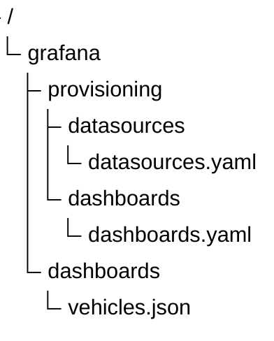

# Cистема мониторинга метрик и телеметрии Prometheus + Grafana порка ТС.

## Архитектура инфраструктуры мониторинга

<details>
<summary> свернуть
</summary>


</details>

## docker compose content

<details>
<summary>compose.yml (свернуть)
</summary>


</details>

## Уведомления

📱 Уведомления приходят на https://t.me/grafana_alerts_armmeh


## Описание проекта
Проект системы сбора, хранения и визуализации метрик для мониторинга парка транспортных средств (ТС) в реальном времени включает в себя:
* [`compose.yml`](./compose.yml) - docker compose,который враз поднимает на сервере (я сделала на одном для экономии собственных средств, так как сервер я подняла на ЯО)
* [terraform проект](./terra/main.tf) для разворачивания виртуальной машины:
    * [terrafrom apply github action](./.github/workflows/terraaply.yml):
        * кроме создания самой ВМ, через секреты github-actions и [`cloud-init.yml`](./terra/cloud-init.yml) в ВМ передаются креды, переменные, необходимые для работы всей инфраструктуры, когда я разворачиваю через [compose.yml](./compose.yml)
    * [terrafrom destroy github action](./.github/workflows/terradestroy.yml) - это я создала для того, чтобы удалить ВМ, даже с телефона. Скоро уеду на недельку, и не хочу брать с собой ноут.
    * *заметьте* - `actions` запускаются по нажатии на кнопку 'run workflow'
* [deploy github actions](./.github/workflows/deploy.yml) - собирает нужные образы моих симуляторов парка и бекенда, публикует в github registry образы, которые потом на сервере будут скачаны/обновлены, когда запуститься [`compose.yml`](./compose.yml).
* [golang проект симуляции парка ТС](./go-projects-group/cmd/vehicle_park_simulator/main.go),который вещает на MQTT брокер в топик `<vehicle_type>/<fuel_type>/<vehicle_id>/telemetry`
* [golang проект, имитирующий бекенд](./go-projects-group/cmd/fleet_backend/main.go),который сохраняет события в базе данных PostgreSQL, приходящие с подписки на MQTT брокер в топик `<vehicle_type>/<fuel_type>/<vehicle_id>/telemetry`. Там, конечно, всё тело меткрики приходит из симуляции, но устала я уж всё делать и решила ограничиться сохранением событий в бд.

* [настройки для MQTT брокера `mosquitto`](./mosquitto/config/mosquitto.conf)
* [настройки для MQTT expoter `mqtt2prometheus`](./mqtt2prometheus/config/config.yml) - здесь я придумала названия для метрик соответствеено путям в json теле приходящего сообщения из mqtt брокера.
* [настройки для `prometheus`](./prometheus/prometheus.yml)
    * здесь прописаны все экспортеры, упомянутые в задаче - node_exporter postgres_exporter, fms_backend, vehicles и дефолтный самого prometheus.
    * обработку метрик, приходящие с mqtt_exporter, (`job: fms_backend`) я описываю тут более детально, чем для дргуих экспортеров. Так как для других экспортеров я использую уже придуманные метрики, к которым уже и есть соотвественно дашборды для графаны, котрые достпуны в свободном скачивании.
    * есть путь, куда записывать данные. Я решила попробовать здесь `victoriametrics`. Потому что - а почему бы и нет.
* [настройки для `grafana`](./prometheus/prometheus.yml):
    * здесь реализован прицип CaaC - `configure as code` в целях поддрежки масштабирования системы мониторинга.
    * Необходимо прописать в конфигурациях:
        1) [./grafana/config/grafana.ini](./grafana/config/grafana.ini) активировать протокол SMTP
        2) [./grafana/provisioning/datasources/datasources.yml](./grafana/provisioning/datasources/datasources.yml) - прописать, откуда брать данные для отображения различных метрик
        3) [./grafana/provisioning/dashboards/dashboards.yml](./grafana/provisioning/dashboards/dashboards.yml) - общая конфигурация дашбордов
        4) [./](./grafana/provisioning/alerting/alerting.yml) - список contact points, куда отправляются алёрты, и правила алёртов с привязкой в панелям в дашбордах. о как я тут много времени просидела же.
        4) [./grafana/dashboards/*.json](./grafana/dashboards) - сами дашборды собственно. названия дашбордов говорящие сами за себя, как говорится:
            * `node_exporter_full.json` - скачала с маркета графаны
            * `postgres_exporter.json` - тоже скачана с маркета графаны в соответствии с именно тем экспортером `postgres_exporter` от графана коммюнити, который я использовала.
            * `park_state.json`, `tractor_details.json`, `events.json` - сама сделала, так как они уникальные в рамках этого проекта. Сначала формировала в UI Grafana, затем эксопртировала json и сохранила.
* [настройки прокси сервера на nginx](./nginx/nginx.conf) на адрес [mymeddata.ru](https://mymeddata.ru/) (это название ничего не значит, просто валялся у меня в сусеках) настроен адрес главной страницы Grafana.


## Походные записи

### Формирование пароля для MQTT brokr mosquitto

```
$ sudo chown 1883:1883 mosquitto/config/password.txt
$ docker exec -it mosquitto mosquitto_passwd -b /mosquitto/config/password.txt <mqtt-user-name> <my-super-power-password>
```

👍 Искреннее уважение к разработчикам этих инструментов за понятные тексты ошибок. А оОшибалась я много.

## Создание пароля для закрытых именно под авторизацией nginx роутов

Роуты см в [./nginx/nginx.conf](./nginx/nginx.conf)

```
docker run --rm -ti alpine sh -c "apk add --no-cache apache2-utils && htpasswd -nb admin secret_password"
```


##  Подход Dashboard-as-Code for Grafana (в графане называют Provisioning).




## 📊 Оцениваю ресурсы для ВМ на компоненты инфраструктуры мониторинга (на 100 активных ТС)

| Компонент | Операции в секунду (RPS / IOPS) | Нагрузка на CPU / ОЗУ | Требования к диску (За сутки) | Критическое место (Bottleneck) |
| :--- | :--- | :--- | :--- | :--- |
| **Mosquitto** | ~10–20 msg/sec | Минимальная (<1% CPU / ~15MB RAM) | 0 MB (Хранит только в памяти) | Пропускная способность сети при росте числа ТС |
| **Go Backend** | ~10–20 parsing/sec | Низкая (~2% CPU / ~40MB RAM) | Только логи контейнера (~10MB) | Скорость пул-соединений (Connection Pool) к Postgres |
| **Postgres DB** | ~1–2 write IOPS (только аномалии) | Низкая (~2% CPU / ~120MB RAM) | ~5–10 MB / сутки | Отсутствие индексов при росте таблицы логов событий, но исправимо |
| **MQTT Exporter** | ~0.06 RPS (1 запрос от Prometheus в 15с) | Минимальная (<0.5% CPU / ~25MB RAM) | 0 MB | Накопление невалидных топиков в оперативной памяти |
| **Prometheus v3** | ~0.25 RPS (опрос 4 экспортеров в 15с) | Средняя (~5% CPU / ~250MB RAM) | ~15–20 MB / сутки (без VM) | Потребление ОЗУ при удержании метрик в кэше (TSDB Head) |
| **VictoriaMetrics** | ~1 write RPS (сжатый поток от Prom) | Низкая (~1% CPU / ~60MB RAM) | **~2–4 MB / сутки** (архивное сжатие) | Права на чтение/запись (I/O) в Docker Volume на диске SSD |
| **Nginx Proxy** | Нагрузка только при запросах диспетчера | Минимальная (<0.5% CPU / ~10MB RAM) | Только логи доступа `access.log` | Объем ОЗУ при обработке тяжелых JSON-выгрузок |
| **Grafana v11** | 1 запрос к DB каждые 5с (автообновление) | Средняя (~3% CPU / ~150MB RAM) | ~1 MB (состояние сессий) | Рендеринг тяжелых графиков в браузере у диспетчера |

1. Расчет сетевого потока (RPS / IOPS)
Для симуляции 45 активных транспортных средств (ТС):

* **Входной поток (Mosquitto & Go Backend):** Каждый симулятор шлет пакет телеметрии в раз в 15 секунд.

\(\text{45\ ТС}/\text{15\ секунд}\approx \text{3\ сообщений\ в\ секунду\ (RPS)}.\)

* **Запись в Postgres DB**: По коду симулятора аномалии (события high_speed, low_fuel и т.д.) генерируются по условию vehicleInfo.ID % 4 или % 5. Это значит, что критические статусы содержатся примерно в каждом 4–5 пакете, а в остальных идет штатный режим без отправки массива Events.

\(\text{3\ RPS}\times 20\%\text{\ аномалий}\approx \text{1\ операции\ записи\ (IOPS)\ в\ секунду}.\)

* **Запросы к Prometheus & Exporter**: Сборщик метрик работает по Pull-модели с фиксированным интервалом 15 секунд. Он делает 1 HTTP-запрос к каждому экспортеру (их 4: backend, mqtt-exporter, node-exporter, postgres-exporter) раз в 15 секунд.

\(\text{4\ запроса}/\text{15\ секунд}=\text{0.26\ RPS}.\)

2. **Расчет объема диска (Disk Space Allocation)VictoriaMetrics**: Одна сырая метрика (Time Series) в Prometheus занимает около 1–2 байт на хосте. 
При 45 машинах и опросе раз в 15 секунд генерируется небольшой объем данных. 
* **VictoriaMetrics**: использует мощное блочное сжатие (ZSTD/Chimp), упаковывая данные в архивы. На практике 45 ТС создают поток не более 1-2 МБ сжатых логов за 24 часа.

* **Postgres DB**: Каждая строка инцидента в таблице events (состоящая из INT, VARCHAR и TEXT лога на 10 символов) весит в среднем 100–150 байт.

\(\text{1\ запись/сек}\times \text{86400\ сек/сутки}\times \text{150\ байт}\approx \text{13\ МБ\ сырых\ данных}.\)

3. **Оценка CPU и ОЗУ (Профили контейнеров)**

* **Mosquitto & MQTT Exporter**: Написаны на C и Go соответственно. Обладают очень малым потреблением. Потока в 3 RPS недостаточно, чтобы нагрузить процессор даже на 1%. Память расходуется только на удержание дескрипторов сетевых сокетов и буферизацию топиков.
* **Go Backend**: Скомпилированный бинарник Go (который я оптимизировала с помощью multi-stage сборки в Dockerfile) работает на нативных потоках ОС (Goroutines). Парсинг JSON для 3 пакетов в секунду занимает около 1 миллисекунд процессорного времени ядра.
* **Grafana**: Сама Grafana потребляет память на кэширование сессий пользователя и рендеринг дашбордов. Запрос автообновления 5s запускает легковесные SQL/PromQL селекторы. Нагрузка возрастает только в момент, когда диспетчер открывает браузер и Grafana начинает отрисовывать графики (SVG/Canvas) на экране клиента.

## Источники (не все)

* [node-exporter-full/](https://grafana.com/grafana/dashboards/1860-node-exporter-full/)

* https://prometheus.io/docs/instrumenting/exporters/

* https://github.com/hikhvar/mqtt2prometheus
* https://github.com/prometheus-community/postgres_exporter

* https://hub.docker.com/r/prom/prometheus/tags
* https://grafana.com/blog/how-to-integrate-grafana-alerting-and-telegram/ 
