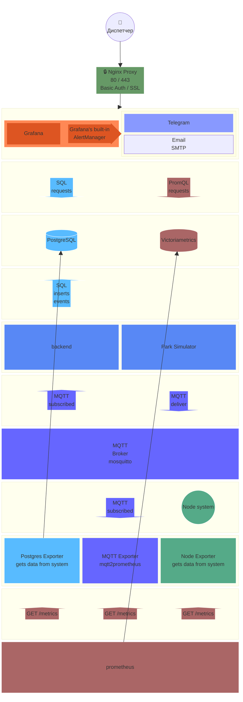

## Архитектура инфраструктуры мониторинга

```mermaid
block
columns 1
  user(("👤<br>Диспетчер"))
  nginx[["🔒 Nginx Proxy<br>80 / 443<br>Basic Auth / SSL"]]
  user --> nginx

  block:grafana
  columns 2
    block:gr
    columns 2
      g["Grafana"]
      gright<["Grafana's built-in<br>AlertManager"]>(right)
    end
    block:agents
    columns 1
      tg["Telegram"] email["Email<br>SMTP"]
    end
  end
  nginx --> grafana

  block:arrows_st
  columns 2
    downsql<["SQL<br>requests"]>(down) 
    downpql<["PromQL<br>requests"]>(down) 
  end

  block:storage
  columns 2
    pg[("PostgreSQL")]
    vm[("Victoriametrics")]
  end
 

  block:arrows_gopr
  columns 2
    upsql<["SQL<br>inserts<br>events"]>(up) 
    space 
  end

  block:gopr
  columns 2
    backend
    ps["Park Simulator"]
  end

  block:arrows_gopr2
  columns 2
    subscribed<["MQTT<br>subscribed"]>(up) 
    tomqttbroker<["MQTT<br>deliver"]>(down)
  end

  mqttbroker["MQTT<br>Broker<br>mosquitto"]

  block:mqtt_exp
  columns 3
    space
    frommqttbroker<["MQTT<br>subscribed"]>(down)
    ns(("Node system"))
  end

  block:exporters
  columns 3
  postgres_exporter["Postgres Exporter<br>gets data from system"]
  mqtt_exporter["MQTT Exporter<br>mqtt2prometheus"]
  node_exporter["Node Exporter<br>gets data from system"]
  end
  postgres_exporter -->pg

  block:promql
  columns 3
    promql_pg<["GET /metrics"]>(up)
    promql_mqtt<["GET /metrics"]>(up)
    promql_node<["GET /metrics"]>(up)
  end
  prometheus -->vm

  classDef nginx_style fill:#696,stroke:#333,stroke-width:0px,color:#fff;
  class nginx nginx_style

  classDef orange fill:#dd5522,stroke:#333,stroke-width:0px,color:#fff;
  class g,gright orange

  classDef lorange fill:#ff8855,stroke:#333,stroke-width:0px,color:#fff;
  class gr lorange
  
  classDef blue fill:#5888f5,stroke:#fff,color:#fff;
  class backend,ps blue
  
  classDef tgblue fill:#8899ff,stroke:#fff,color:#fff;
  class tg tgblue

  classDef deepblue fill:#6666ff,stroke:#fff,color:#ff0000,stroke-width:0px;
  class mqttbroker,mqtt_exporter,frommqttbroker,subscribed,tomqttbroker deepblue

  classDef red fill:#aa6666,stroke:#fff,color:#fff,stroke-width:0px;
  class prometheus,vm,downpql,promql_pg,promql_mqtt,promql_node red

  classDef lightblue fill:#58bbff,stroke:#fff,color:#fff;
  class postgres_exporter,pg,upsql,downsql lightblue

  classDef green fill:#55aa88,stroke:#fff,color:#fff;
  class node_exporter,ns green
```